# DAGs in R

There are a vast array of packages available in R for doing all kinds of data analytics and statistical analysis. Some of those use the DAG as either a fundamental data structure hidden inside the package or provide the user access to the DAG for constructing, learning, or visualizing.

```{r}
#| output: false
library(ggdag)
library(ggplot2)
library(dagitty)
library(igraph)
source("./r/plot_dag.R")
```

### DOT notation

The [DOT language](https://graphviz.org/doc/info/lang.html) is a plain-text script language used to describe graphs (including DAGs) in a way that both humans and computers can easily read.

```dot
digraph MiningWorkflow {
  // Global graph attributes for clean layout
  rankdir=LR; // Lays out the graph from Left to Right instead of Top to Bottom
  node [shape=box, style=filled, fillcolor=lightblue]; // Default styling for nodes

  // Define the sequence/dependencies
  Drill_Assays -> Block_Model;
  Geotech_Data -> Pit_Design;
  Block_Model -> Pit_Design;
    
  Pit_Design -> Mine_Scheduling;
  Mine_Scheduling -> Ore_Extraction;
    
  // Customizing specific nodes for clarity
  Ore_Extraction -> Crushing_Plant [label="Run of Mine"];
  Crushing_Plant -> Flotation_Cells;
  Flotation_Cells -> Concentrate_Output [color=gold, penwidth=2];
    
  // Highlight the final output node
  Concentrate_Output [shape=ellipse, fillcolor=gold];
}
```



### R formula notation

The R formula is a first class object in the R programming language and is used extensive in R. A formula uses the symbol `~` instead of `=`.

```{r}
library(dagitty)

# Formula notation
dagified <- dagify(x ~ z,
  y ~ z,
  a ~~ z,
  exposure = "x",
  outcome = "y"
)
tidy_dagitty(dagified)
```

### Model String

In the R package `bnlearn`, network structures are represented via a compact string format known as a model string. This syntax is primarily used in the `model2network()` and `modelstring()` functions to define or extract Directed Acyclic Graphs (DAGs).

```{r}
library(bnlearn)
dag <- "[S][X|S]"
dag <- model2network(dag)
```

## Visualizing a DAG

```{r}
#| label: fig-dag
#| fig-cap: "Example DAG"
#| fig.width: 6
#| fig.height: 4
dagify(
  E ~ I + C,
  G ~ C,
  S ~ E + L,
  M ~ E,
  D ~ E + M + L + G + J,
  Z ~ D
) |> plot_dag(layout="stress")
```

If the DAG represents a computational graph then the topological sort ($I$, $C$, $L$, $J$, $E$, $G$, $S$, $M$, $D$, and $Z$) denotes the order of computation.
  
```{r}
c("I", "E", "C", "E", "C", "G", "E", "S", "L", "S",
  "E", "M", "E", "D", "M", "D", "L", "D", "G", "D",
  "J", "D", "D", "Z") |>
  make_directed_graph() |>
  topo_sort() |>
  (\(x) print(names(x)))()
```

```{r}
dagify(
  E ~ I + C,
  G ~ C,
  S ~ E + L,
  M ~ E,
  D ~ E + M + L + G + J,
  Z ~ D
) |> markovBlanket("D")
```

## Computational DAG

### Base R example

First define the computational functions:

```{r}
# Define individual nodes as pure functions mapping inputs to outputs
node_X <- function() {
  return(5) # Base input
}

node_Y <- function(x) {
  return(x^2 + 2)
}

node_Z <- function(y) {
  return(sqrt(y) * 3)
}

node_W <- function(x, z) {
  return(x * z)
}

# The execution wrapper acting as the DAG coordinator
execute_dag <- function() {
  # Topological order enforcement: X must happen first
  val_x <- node_X()
  
  # Y needs X
  val_y <- node_Y(val_x)
  
  # Z needs Y
  val_z <- node_Z(val_y)
  
  # W needs both X and Z
  val_w <- node_W(val_x, val_z)
  
  return(list(X = val_x, Y = val_y, Z = val_z, W = val_w))
}
```

Now run the computation:

```{r}
results <- execute_dag()
print(results)
```

To explicitly map out the graph structure mathematically, we can pass our dependencies into `igraph` or use `ggdag`.

```{R}
# Define the directed edges based on our functions above
# X -> Y, Y -> Z, X -> W, Z -> W
edges <- c("X", "Y", 
           "Y", "Z", 
           "X", "W", 
           "Z", "W")

# Create the graph object
math_dag <- make_graph(edges, directed = TRUE)

# Verify that it is mathematically acyclic
is_dag(math_dag) # Should return TRUE

# Plot the computational layout
plot(math_dag, 
     vertex.color = "lightblue", 
     vertex.size = 30, 
     edge.arrow.size = 0.6,
     main = "Mathematical Computational DAG")
```
